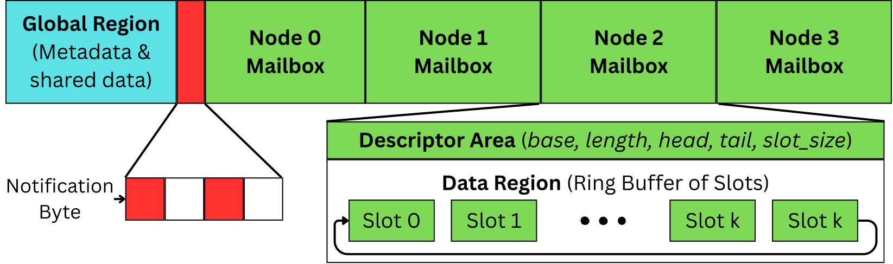

# IPC

Multi-MCU inter-process communication system using shared SPI FRAM with hardware-based lock arbitration.

## Features

- **Shared FRAM access**: Single external SPI FRAM shared among multiple MCUs
- **Hardware arbitration**: Dedicated REQ/GNT protocol ensures exclusive FRAM access
- **Mailbox-based messaging**: Fixed-size message slots with per-node ring buffers
- **Bulk transfers**: Efficient batch operations for sending multiple messages
- **Scalable architecture**: Supports 1 arbiter and multiple workers (tested upto 3 workers)

## File Structure

```
.
├── SPI_Arbitrar_5969/       # Arbiter (master) MCU code
│   ├── main.c               # Arbiter logic, REQ/GNT handling
│   ├── fram.c/h             # FRAM SPI driver (arbiter side)
│   ├── mailbox.c/h          # Mailbox management
│   ├── uart.c/h             # UART debug interface
│
└── SPI_Worker_5969/         # Worker node MCU code
    ├── main.c               # Worker logic, lock acquisition
    ├── fram.c/h             # FRAM SPI driver (worker side)
    ├── mailbox.c/h          # Mailbox operations
    └── uart.c/h             # UART debug interface
```

## Wiring and Connections

### MCU
- This wiring is for **MSP430FR5969**, pin mapping have to be changed for MSP430FR5949

### SPI Bus (UCB0) - Shared by All MCUs
| Signal | Pin  | Description           |
|--------|------|-----------------------|
| MOSI   | P1.6 | Master Out Slave In   |
| MISO   | P1.7 | Master In Slave Out   |
| SCK    | P2.2 | SPI Clock             |
| CS#    | P1.5 | FRAM Chip Select      |

### REQ/GNT Pairs (Arbiter ↔ Workers)

**Arbiter Pins:**

| Worker | REQ (Input) | GNT (I/O) | Description              |
|--------|-------------|-----------|--------------------------|
| Node 1 | P1.4        | P1.3      | Request/Grant for Node 1 |
| Node 2 | P1.2        | P3.0      | Request/Grant for Node 2 |
| Node 3 | P3.5        | P3.6      | Request/Grant for Node 3 |

**Worker Pins (same for all workers):**

| Signal | Pin  | Description                |
|--------|------|----------------------------|
| REQ    | P1.4 | Request line to arbiter    |
| GNT    | P1.3 | Grant line from arbiter    |

### Protocol
- Default state: Pull-down (logic 0)
- Signaling: Brief HIGH pulses
- Interrupts: Triggered on low→high edges
- Only one MCU accesses FRAM at a time, enforced by the lock protocol

## Usage

### Lock Management

```c
lock_acquire()
```
Requests and acquires exclusive access to the shared FRAM. Worker sends REQ pulse and waits for GNT from arbiter.

```c
lock_release()
```
Releases the FRAM lock so that other nodes can access it. Worker sends REQ pulse to signal release.

### Mailbox Operations

<a href="../misc/mailbox.svg">
  
</a>

**All mailbox operations must be performed while holding the FRAM lock.**

```c
mailbox_send_msg(dest, src, buf, len)
```
Enqueues a single message of length `len` from `src` into the mailbox of node `dest`.
- `dest`: Destination node index (0-3)
- `src`: Source node ID
- `buf`: Message payload buffer
- `len`: Payload length (≤ 60 bytes)
- Returns: 1 on success, 0 on failure

```c
mailbox_send_bulk(dest, src, buf, total_len)
```
Sends bulk data from `src` to node `dest` using an optimized FRAM write.
- `dest`: Destination node index (0-3)
- `src`: Source node ID
- `buf`: Data buffer
- `total_len`: Total data length
- Returns: 1 on success, 0 on failure

```c
mailbox_recv_msg(id, src_out, len_out, buf)
```
Dequeues the next message for node `id` and returns its source and payload.
- `id`: This node's index
- `src_out`: Pointer to store source node ID
- `len_out`: Pointer to store payload length
- `buf`: Buffer to receive payload (≥ 60 bytes)
- Returns: 1 on success, 0 if mailbox empty

## Notes

- **FRAM Layout**: 4 mailboxes @ 20 kB each, starting at `0x01000`, `0x06000`, `0x0B000`, `0x10000`
- **Message Slots**: Fixed 64-byte slots (4-byte header + 60-byte payload max)
- **Notification Mechanism**: Global FRAM byte (`0x00010`) tracks which nodes have pending messages
- **Initialization**: Call `mailbox_init_layout()` once during system setup to initialize all mailbox descriptors
- **Node Configuration**: Workers must set `NODE_ID` (1-3) during compilation
- **UART Debug**: Both arbiter and workers support UART output on P2.0 (TX) / P2.1 (RX) for debugging
