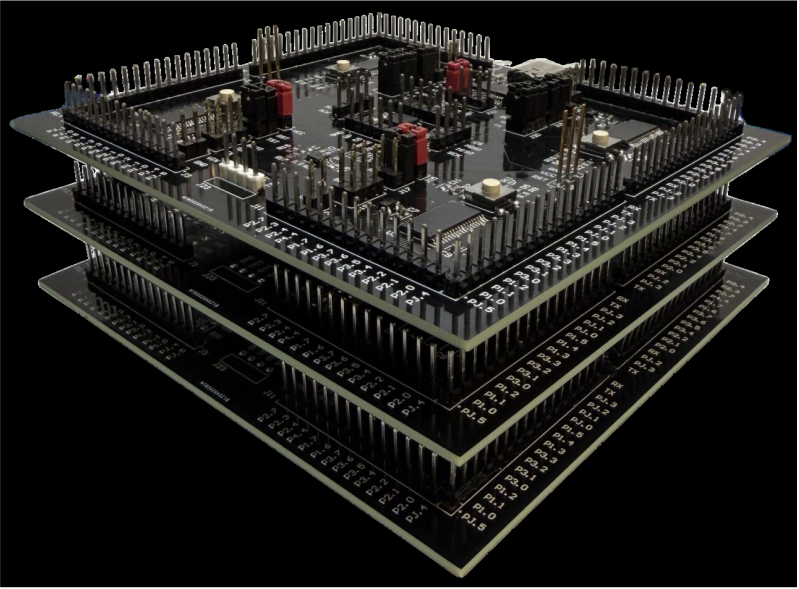

# MicroSymphony

MicroSymphony is a modular multi-microcontroller platform designed for **compute-first microwatt systems**. Instead of relying on a single MCU to multiplex sensing, computation, and communication, MicroSymphony physically distributes these roles across multiple ultra-low-power microcontrollers that operate concurrently while remaining power- and clock-isolated.

At its core, the platform enables predictable concurrency under tight energy budgets. Each board integrates multiple independent MCUs, a lightweight mechanism for programming them from a single host connection, and a inter-processor communication substrate built on shared non-volatile memory. This architecture avoids the timing conflicts, interrupt interference, and memory pressure inherent in monolithic single-MCU designs, while remaining simple enough for microwatt-class devices.

## Repository Structure

- [`hardware/`](https://github.com/weiserlab/MicroSymphony/tree/main/hardware)  
  Schematics, PCB designs, and platform documentation (under consturction) for the MicroSymphony multi-MCU platform.

- [`Vega_Bootloader/`](https://github.com/weiserlab/MicroSymphony/tree/main/Vega%20Bootloader#vega-bootloader)  
  The Vega programming framework, which repurposes a shared UART bus to enable low-latency programming of multiple microcontrollers from a single host interface. It supports both broadcast and individually addressed firmware updates without requiring per-MCU debug probes.

- [`IPC/`](https://github.com/weiserlab/MicroSymphony/tree/main/IPC#ipc)  
  The inter-processor communication layer that coordinates independent MCUs using a shared FRAM-based mailbox abstraction with explicit arbitration. This design provides deterministic, low-overhead communication suitable for intermittent and energy-constrained operation.

- [`Applications/`](https://github.com/weiserlab/MicroSymphony/tree/main/Applications)
  Applications designed using MicroSymphony framework. (Will be updated with more soon)

## Scope

This repository focuses on the **platform, programming, and communication mechanisms** required to build and experiment with multi-microcontroller systems at microwatt power levels. The work is under active development

